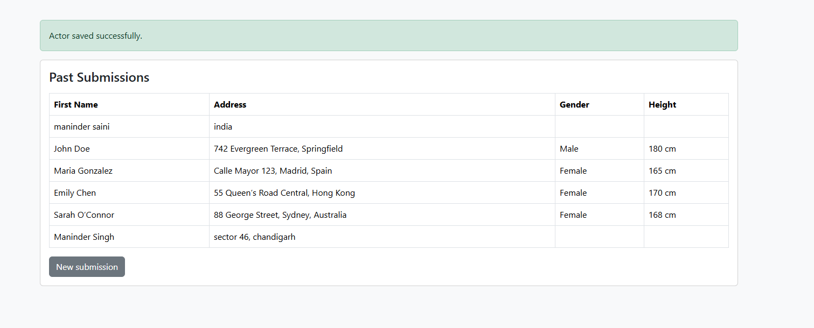
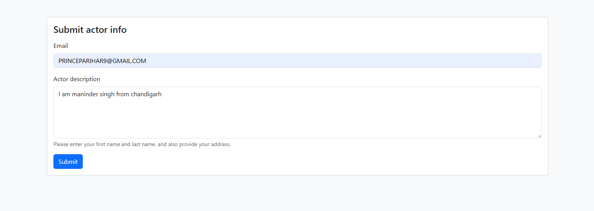
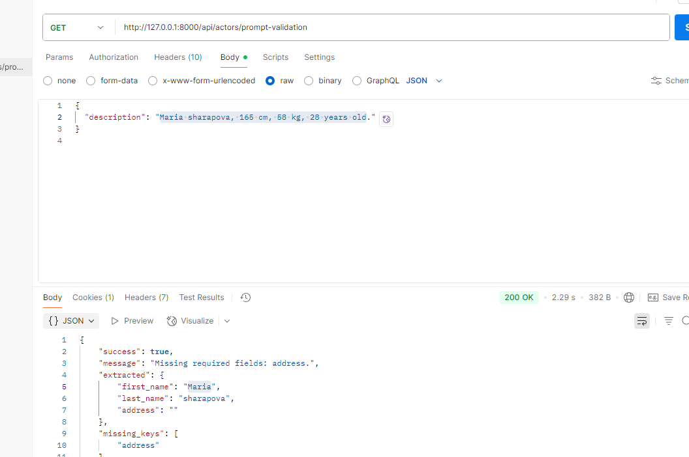
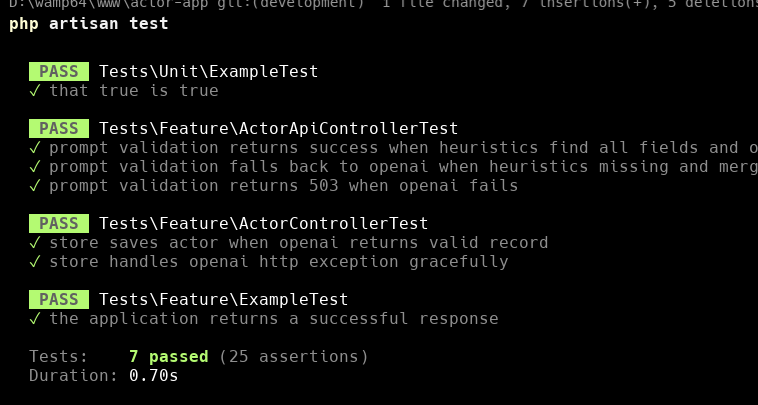

# Actor Extraction App

**Laravel-based Actor Management App** with AI-powered data extraction (OpenAI) to parse names, addresses and basic profile fields from free-form text.

- Tech: PHP (Laravel), PHPUnit tests, OpenAI integration (optional), Postman collection for manual testing.
- Purpose: extract `first_name`, `last_name`, `address`, `height`, `weight`, `gender`, and `age` from free-form descriptions using heuristics and OpenAI fallback.

---

## Table of Contents

- [Requirements](#requirements)  
- [Quick install (local dev)](#quick-install-local-dev)  
- [Environment variables](#environment-variables)  
- [Usage](#usage)  
  - [Web UI](#web-ui)  
  - [API](#api)  
- [Postman collection](#postman-collection)  
- [Running tests](#running-tests)  
- [Troubleshooting](#troubleshooting)  
- [Contributing & opening a PR](#contributing--opening-a-pr)  
- [License](#license)

---

## Requirements

- PHP 8.1+ (or matching your Laravel version)
- Composer
- Node.js & npm (optional for front-end assets)
- SQLite (recommended for tests) or MySQL/Postgres
- Git
- (Optional) `gh` GitHub CLI to create PRs from your terminal

---

## Quick install (local dev)

```bash
# clone
git clone https://github.com/sttech321/actor-extraction-app.git
cd actor-extraction-app

# install PHP deps
composer install

# copy env and generate key
cp .env.example .env
php artisan key:generate

# recommended quick DB (sqlite)
mysql 

# run migrations
php artisan migrate

# optional: seed
php artisan db:seed

# optional: build assets
npm install
npm run dev

# run dev server
php artisan serve
# open http://127.0.0.1:8000


#env setting

APP_NAME="Actor App"
APP_ENV=local
APP_URL=http://127.0.0.1:8000

DB_CONNECTION=mysql
DB_HOST=127.0.0.1
DB_PORT=3306
DB_DATABASE=actor_app
DB_USERNAME=root
DB_PASSWORD= 

# Optional: provide an OpenAI API key to enable AI fallback
OPENAI_API_KEY=sk-...


# run all tests
php artisan test

# run only feature tests
php artisan test --testsuite=Feature

# run single class
php artisan test --filter ActorControllerTest

#Postman collection
{
  "info": {
    "name": "Actor Extraction App",
    "description": "Postman collection for Actor Extraction App endpoints",
    "schema": "https://schema.getpostman.com/json/collection/v2.1.0/collection.json",
    "version": "1.0.0"
  },
  "item": [
    {
      "name": "Prompt Validation (API)",
      "request": {
        "method": "POST",
        "header": [
          { "key": "Content-Type", "value": "application/json" },
          { "key": "Accept", "value": "application/json" }
        ],
        "body": {
          "mode": "raw",
          "raw": "{\n  \"description\": \"John Doe, 742 Evergreen Terrace, Springfield. Male, 180 cm, 75 kg, 32 years old.\"\n}",
          "options": { "raw": { "language": "json" } }
        },
        "url": {
          "raw": "http://127.0.0.1:8000/api/actors/prompt-validation",
          "protocol": "http",
          "host": ["127","0","0","1"],
          "port": "8000",
          "path": ["api","actors","prompt-validation"]
        }
      },
      "response": []
    },
    {
      "name": "Create Actor (form)",
      "request": {
        "method": "POST",
        "header": [
          { "key": "Accept", "value": "application/json" }
        ],
        "body": {
          "mode": "formdata",
          "formdata": [
            { "key": "email", "value": "test@example.com", "type": "text" },
            { "key": "description", "value": "John Doe, 742 Evergreen Terrace, Springfield. Male, 180 cm, 75 kg, 32 years old.", "type": "text" }
          ]
        },
        "url": {
          "raw": "http://127.0.0.1:8000/actors",
          "protocol": "http",
          "host": ["127","0","0","1"],
          "port": "8000",
          "path": ["actors"]
        }
      },
      "response": []
    }
  ]
}

#



